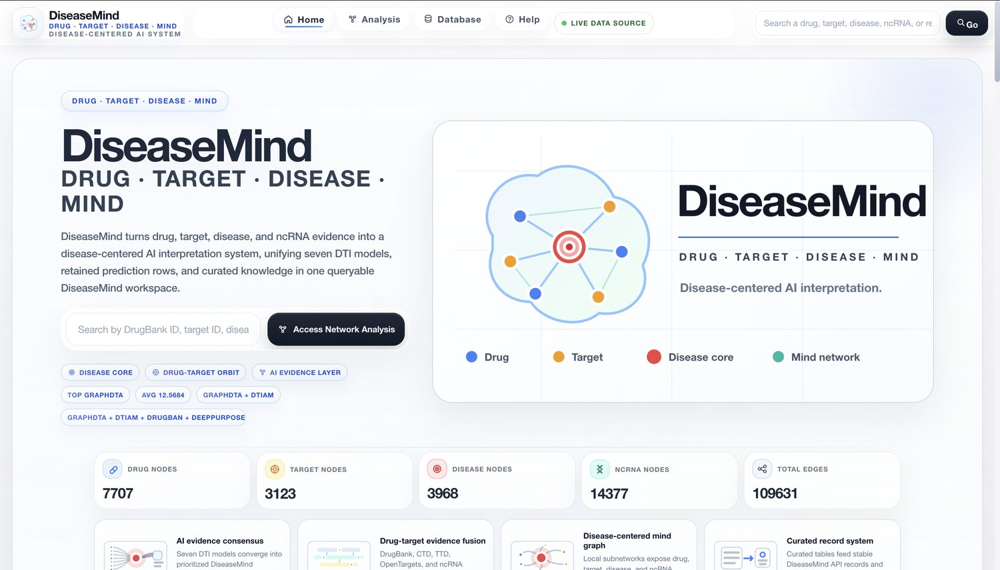
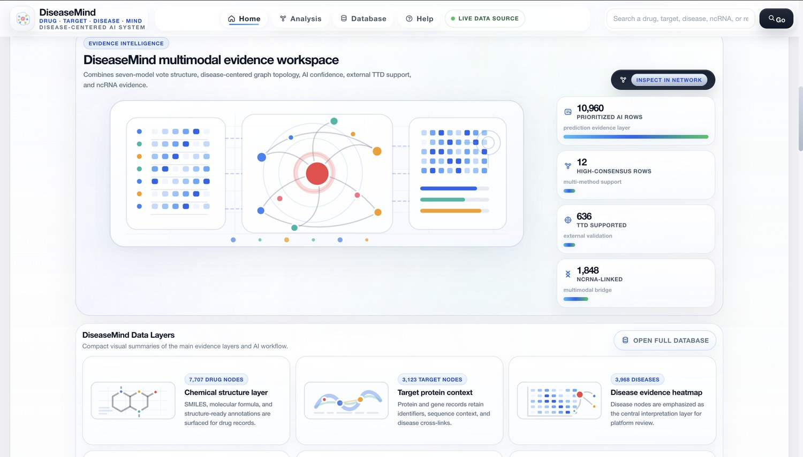
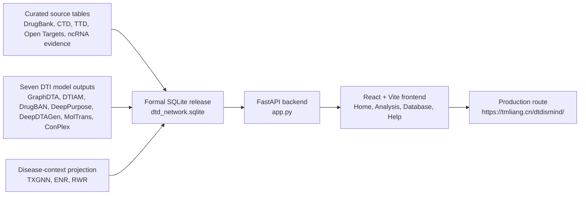

# DTDisMind

<p align="center">
  
</p>

<h3 align="center">Drug · Target · Disease · Mind</h3>

<p align="center">
  DTDisMind is a confidence-annotated drug-target-disease atlas that integrates ensemble target inference, curated biomedical evidence, and ncRNA regulatory context.
</p>

<p align="center">
  <a href="https://tmliang.cn/dtdismind/">Live platform</a>
  ·
  <a href="#release-snapshot">Release snapshot</a>
  ·
  <a href="#quick-start">Quick start</a>
  ·
  <a href="#data-availability-and-licensing">Data availability and licensing</a>
</p>

<p align="center">
  
  
  
  
  
  
</p>



## Overview

DTDisMind (Drug-Target-Disease + Mind) converts dispersed drug-target, drug-disease, target-disease, and ncRNA evidence into queryable disease-contextualized DTD records. It harmonizes curated entities and pairwise evidence from DrugBank 6.0, CTD, PubChem, UniProt, TTD cross-references, Open Targets, and ncRNA-related sources; evaluates a screenable drug-target space with a seven-model ensemble; projects high-confidence DTI pairs into disease contexts with TXGNN, ENR, and RWR; and preserves model-, algorithm-, and source-level provenance for each released triplet.

The repository contains the FastAPI service, React/Vite frontend, deployment assets, smoke tests, static production build, and README-ready visual documentation. The formal SQLite release database is supplied through `DTD_DB_PATH`; large `.sqlite` files are intentionally excluded from Git history.

## Release Snapshot

Release `v1.0` corresponds to the manuscript-associated DTDisMind build described in *DTDisMind: a confidence-annotated drug-target-disease atlas integrating ensemble target inference and ncRNA context*.

| Metric | Value |
| --- | ---: |
| Network nodes | 29,175 |
| Network edges | 109,631 |
| Drug nodes | 7,707 |
| Protein target nodes | 3,123 |
| Disease nodes | 3,968 |
| ncRNA nodes | 14,377 |
| Screenable DTI universe | 18,016,322 pairs |
| Screenable drugs x targets | 6,439 x 2,798 |
| High-confidence DTI candidates | 9,912 |
| High-confidence core DTD triplets | 5,602 |
| Expanded web-layer DTD triplets | 10,960 |
| DrugBank interactions recaptured by Core5+2 | 213 |
| DrugBank enrichment in retained DTI candidates | 24.0-fold |

### Count definitions

- **9,912 high-confidence DTI candidates** are drug-target pairs retained after seven-model ensemble voting with the Core5+2 rule: Core5 votes >= 3 and total votes >= 4.
- **5,602 high-confidence core DTD triplets** are the manuscript analysis layer. They are assembled from the retained DTI candidates after disease-context projection by TXGNN, ENR, and RWR, per-drug top-50 capping, support filtering, and deduplication. This core spans 754 drugs, 1,263 targets, and 169 diseases.
- **10,960 expanded web-layer DTD triplets** are the browsable platform layer. It includes the 5,602 core triplets plus additional curated-evidence-supported vote 2-3 candidates and remaining Core5+2 candidates assigned their top-ranked TXGNN disease.

The 10,960 value is therefore not a duplicate of the 9,912 DTI candidate count: the former is a disease-contextualized web-layer triplet count, while the latter is a drug-target candidate count before disease projection.

### Evidence layers

| Layer | Current scale |
| --- | ---: |
| Drug-Target edges | 29,031 |
| Drug-Disease edges | 7,017 |
| Target-Disease edges | 23,169 |
| ncRNA-Drug edges | 25,647 |
| ncRNA-Disease edges | 23,472 |
| ncRNA-Target edges | 1,295 |
| Known ncRNA-drug evidence rows | 36,168 |
| TTD therapeutic target mappings | 86,644 |
| Open Targets target-disease matches | 5,163 |

## Product Tour

<table>
  <tr>
    <td width="50%">
      
      <br />
      <strong>Database workspace</strong>
      <br />
      Browse nodes, relationships, prediction records, model support, and exportable evidence tables.
    </td>
    <td width="50%">
      
      <br />
      <strong>Disease-centered network analysis</strong>
      <br />
      Inspect local drug-target-disease-ncRNA neighborhoods with evidence rings, edge classes, and node details.
    </td>
  </tr>
  <tr>
    <td colspan="2">
      
      <br />
      <strong>Multimodal evidence workspace</strong>
      <br />
      Connect seven-model DTI votes, confidence annotations, graph topology, TTD support, molecular structure context, and ncRNA evidence in one review surface.
    </td>
  </tr>
</table>

## Architecture



## Feature Set

- DTDisMind-branded React interface with Home, Analysis, Database, and Help views.
- Global search and suggestions for drugs, targets, diseases, ncRNAs, and disease aliases.
- Disease-centered network rendering with category/type filters, density controls, current-center history, and share links.
- Node detail panels with edge summaries, molecular structures, annotation context, and paginated neighbors.
- Online analysis filters for evidence-method support, seven-model votes, TXGNN, ENR, RWR, and ncRNA type.
- Browseable and exportable node, edge, prediction, ncRNA evidence, and ncRNA edge tables.
- FastAPI endpoints for read-only SQLite access, gzip, CORS, asset cache headers, and `/dtdismind/` subpath serving.
- GSAP-backed page and interface motion with reduced-motion support through the frontend motion layer.

## Repository Layout

```text
dtd_platform/
├── app.py                         # FastAPI backend and API routes
├── frontend/                      # React/Vite source
│   ├── src/components/            # Home, Analysis, Database, Help, graph canvas
│   ├── src/motion/                # GSAP motion hooks
│   └── vite.config.js             # /dtdismind/ production base and dev proxy
├── static/                        # Built frontend assets served by FastAPI
├── deploy/                        # Production run script, nginx, systemd templates
├── tests/                         # Endpoint smoke tests
├── resultsdti/                    # Retained DTI result artifacts committed with the app
├── docs/assets/                   # README screenshots
├── requirements.txt               # Runtime Python dependencies
└── requirements-dev.txt           # Test dependencies
```

## Quick Start

### 1. Backend

```bash
git clone https://github.com/JHHE427/dtd_platform.git
cd dtd_platform

python3 -m venv .venv
source .venv/bin/activate
python3 -m pip install -r requirements.txt

export DTD_DB_PATH=/absolute/path/to/dtd_network.sqlite
python3 -m uvicorn app:app --host 127.0.0.1 --port 8787 --reload
```

Open:

```text
http://127.0.0.1:8787/dtdismind/
```

### 2. Frontend Development

```bash
cd frontend
npm install
npm run dev
```

Vite serves the app at:

```text
http://127.0.0.1:5173/dtdismind/
```

The dev server proxies `/api` and `/dtdismind/api` to `http://127.0.0.1:8787`.

### 3. Production Build

```bash
cd frontend
npm install
npm run build
```

The build writes hashed assets to `../static/`, which `app.py` serves directly.

## Configuration

| Variable | Purpose |
| --- | --- |
| `DTD_DB_PATH` | Absolute path to the formal SQLite release database. |
| `DTD_CORS_ORIGINS` | Comma-separated allowed origins for API calls. Defaults to local development origins. |
| `DTD_RESULTS_DTI_FILE` / `DTD_RESULTS_DTI_DIR` | Optional override for seven-model DTI result CSVs. |
| `DTD_NCRNA_OUTPUT_DIR` | Optional override for ncRNA evidence output files. |
| `DTD_TTD_OUTPUT_DIR` | Optional override for TTD validation output files. |

## API Surface

Core health and metadata:

```text
GET /api/health
GET /api/ready
GET /api/meta/stats
GET /api/meta/research-summary
```

Search, graph, and node inspection:

```text
GET /api/search?q=imatinib
GET /api/suggest?q=breast
GET /api/graph?center_id=DB00619&mode=full&depth=2&limit=300
GET /api/node/{node_id}
GET /api/node/{node_id}/neighbors
GET /api/path?source_id={source}&target_id={target}&max_hops=4
```

Database and result tables:

```text
GET /api/nodes
GET /api/edges
GET /api/results/predictions
GET /api/results/ncrna/evidence
GET /api/results/ncrna/edges
GET /api/analysis/online
GET /api/analysis/online/subgraph
GET /api/compare/drugs
```

## Validation

Install development dependencies and run smoke tests against a real database:

```bash
python3 -m pip install -r requirements-dev.txt
DTD_DB_PATH=/absolute/path/to/dtd_network.sqlite pytest -q
```

Useful local checks:

```bash
curl http://127.0.0.1:8787/api/health
curl http://127.0.0.1:8787/api/meta/stats
curl "http://127.0.0.1:8787/api/results/predictions?page=1&page_size=1"
```

Frontend build check:

```bash
cd frontend
npm run build
```

## Deployment

Current public production URL:

```text
https://tmliang.cn/dtdismind/
```

The production route proxies `/dtdismind/` to the internal FastAPI service. See [DEPLOYMENT_GUIDE.md](DEPLOYMENT_GUIDE.md) for the nginx and process templates.

## Data Availability and Licensing

DTDisMind v1.0 is freely accessible at:

```text
https://tmliang.cn/dtdismind/
```

Released drug, target, disease, ncRNA, edge, DTI prediction, disease-support, and DTD-triplet tables can be browsed and downloaded through the website, subject to source-database licensing constraints. The manuscript analyses use the 5,602-triplet high-confidence core; the web platform also exposes the expanded 10,960-triplet layer for broader exploration.

Source code is released under the MIT License in [LICENSE](LICENSE). This code license does not grant redistribution rights for third-party data or for a packaged SQLite database assembled from restricted source resources.

Third-party data-use boundaries:

- DrugBank-derived drug identifiers, pharmacological target records, approval/status annotations, and indication-derived drug-disease evidence remain subject to DrugBank terms. Users who need DrugBank-controlled source records should obtain them directly from DrugBank under the appropriate licence.
- TTD, CTD, PubChem, UniProt, Open Targets, BindingDB, Davis, KIBA, and ncRNA source records retain their original database licences, citation requirements, and redistribution conditions.
- DTDisMind downloadable and derived tables are provided for inspection and reuse only where compatible with the original source terms. Records that include restricted third-party fields should not be redistributed independently of those terms.
- The GitHub repository is intended to support code review, API inspection, reproducible deployment, and versioned release tracking. The formal release database is kept outside Git history because of size, update-management, and source-licensing constraints.

## Release Management

- `v1.0` marks the manuscript-associated release described above; release notes are summarized in [CHANGELOG.md](CHANGELOG.md).
- Each future release should carry a Git tag and release notes documenting source versions, download dates, database rebuild changes, entity-level diffs, and any updates to the 5,602 core triplets or 10,960 expanded web-layer triplets.
- The live platform should remain synchronized with the latest tagged release or clearly state when it is running a newer development build.
