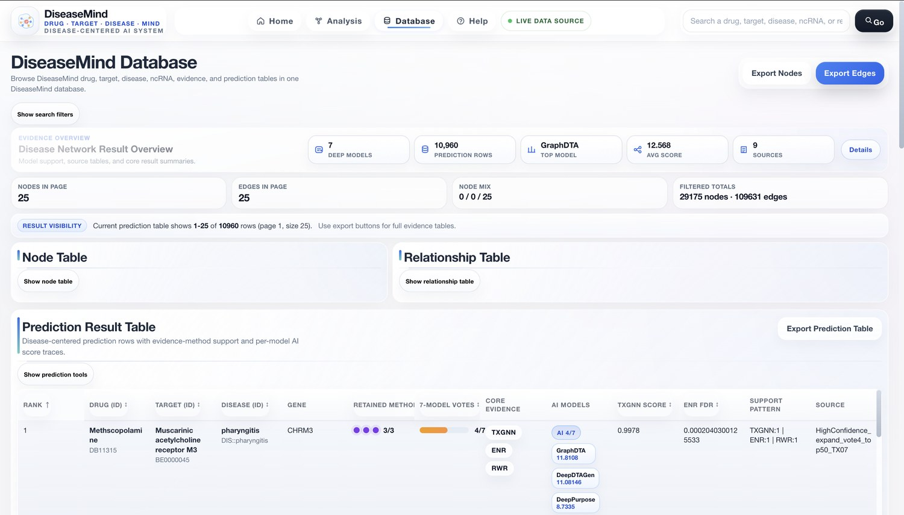
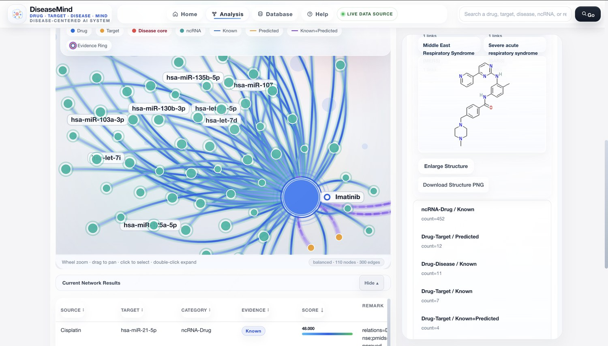
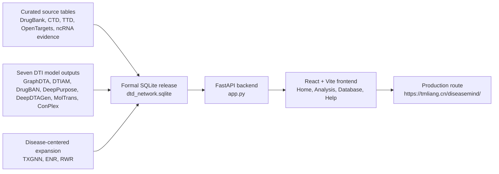

# DiseaseMind

<p align="center">
  
</p>

<h3 align="center">Drug · Target · Disease · Mind</h3>

<p align="center">
  DiseaseMind is a disease-centered AI interpretation workspace for exploring drug, target, disease, and ncRNA evidence in one queryable network.
</p>

<p align="center">
  <a href="https://tmliang.cn/diseasemind/">Live platform</a>
  ·
  <a href="#quick-start">Quick start</a>
  ·
  <a href="#api-surface">API surface</a>
  ·
  <a href="#deployment">Deployment</a>
</p>

<p align="center">
  
  
  
  
  
</p>


## Overview

DiseaseMind turns retained drug-target interaction predictions, disease-centered expansion results, curated drug/disease/target knowledge, therapeutic target annotations, and ncRNA evidence into a production web platform. The repository contains the FastAPI service, React/Vite frontend, deployment assets, smoke tests, and README-ready visual documentation.

The release is intentionally database-backed. The platform expects a formal SQLite release database through `DTD_DB_PATH`; large `.sqlite` files are excluded from Git history.

## Current Release Snapshot

| Metric | Value |
| --- | ---: |
| Network nodes | 29,175 |
| Network edges | 109,631 |
| Drug nodes | 7,707 |
| Target nodes | 3,123 |
| Disease nodes | 3,968 |
| ncRNA nodes | 14,377 |
| Retained prediction rows | 10,960 |
| Raw DTI pairs screened | 18,016,322 |
| High-consensus rows | 12 |
| TTD-supported evidence rows | 636 |

### Evidence Layers

| Layer | Current scale |
| --- | ---: |
| Drug-Target edges | 29,031 |
| Drug-Disease edges | 7,017 |
| Target-Disease edges | 23,169 |
| ncRNA-Drug edges | 25,647 |
| ncRNA-Disease edges | 23,472 |
| ncRNA-Target edges | 1,295 |
| Known ncRNA-drug evidence rows | 36,168 |
| TTD therapeutic target mappings | 86,644 |
| OpenTargets target-disease matches | 5,163 |

## Product Tour

<table>
  <tr>
    <td width="50%">
      
      <br />
      <strong>Database workspace</strong>
      <br />
      Browse nodes, relationships, prediction records, model support, and exportable evidence tables.
    </td>
    <td width="50%">
      
      <br />
      <strong>Disease-centered network analysis</strong>
      <br />
      Inspect local drug-target-disease-ncRNA neighborhoods with evidence rings, edge classes, and node details.
    </td>
  </tr>
  <tr>
    <td colspan="2">
      
      <br />
      <strong>Multimodal evidence workspace</strong>
      <br />
      Connect seven-model DTI votes, AI confidence, graph topology, TTD support, molecular structure context, and ncRNA evidence in one review surface.
    </td>
  </tr>
</table>

## Architecture



## Feature Set

- DiseaseMind-branded React interface with Home, Analysis, Database, and Help views.
- Global search and suggestions for drugs, targets, diseases, ncRNAs, and disease aliases.
- Disease-centered network rendering with category/type filters, density controls, current-center history, and share links.
- Node detail panels with edge summaries, molecular structures, annotation context, and paginated neighbors.
- Online analysis filters for evidence-method support, seven-model votes, TXGNN, ENR, RWR, and ncRNA type.
- Browseable and exportable node, edge, prediction, ncRNA evidence, and ncRNA edge tables.
- FastAPI endpoints hardened for read-only SQLite access, gzip, CORS, asset cache headers, and `/diseasemind/` subpath serving.
- GSAP-backed page and interface motion with reduced-motion support through the frontend motion layer.

## Repository Layout

```text
dtd_platform/
├── app.py                         # FastAPI backend and API routes
├── frontend/                      # React/Vite source
│   ├── src/components/            # Home, Analysis, Database, Help, graph canvas
│   ├── src/motion/                # GSAP motion hooks
│   └── vite.config.js             # /diseasemind/ production base and dev proxy
├── static/                        # Built frontend assets served by FastAPI
├── deploy/                        # Production run script, nginx, systemd templates
├── tests/                         # Endpoint smoke tests
├── resultsdti/                    # Retained DTI result artifacts committed with the app
├── docs/assets/                   # README screenshots
├── requirements.txt               # Runtime Python dependencies
└── requirements-dev.txt           # Test dependencies
```

## Quick Start

### 1. Backend

```bash
git clone https://github.com/JHHE427/dtd_platform.git
cd dtd_platform

python3 -m venv .venv
source .venv/bin/activate
python3 -m pip install -r requirements.txt

export DTD_DB_PATH=/absolute/path/to/dtd_network.sqlite
python3 -m uvicorn app:app --host 127.0.0.1 --port 8787 --reload
```

Open:

```text
http://127.0.0.1:8787/diseasemind/
```

### 2. Frontend Development

```bash
cd frontend
npm install
npm run dev
```

Vite serves the app at:

```text
http://127.0.0.1:5173/diseasemind/
```

The dev server proxies `/api` and `/diseasemind/api` to `http://127.0.0.1:8787`.

### 3. Production Build

```bash
cd frontend
npm install
npm run build
```

The build writes hashed assets to `../static/`, which `app.py` serves directly.

## Configuration

| Variable | Purpose |
| --- | --- |
| `DTD_DB_PATH` | Absolute path to the formal SQLite release database. |
| `DTD_CORS_ORIGINS` | Comma-separated allowed origins for API calls. Defaults to local development origins. |
| `DTD_RESULTS_DTI_FILE` / `DTD_RESULTS_DTI_DIR` | Optional override for seven-model DTI result CSVs. |
| `DTD_NCRNA_OUTPUT_DIR` | Optional override for ncRNA evidence output files. |
| `DTD_TTD_OUTPUT_DIR` | Optional override for TTD validation output files. |

## API Surface

Core health and metadata:

```text
GET /api/health
GET /api/ready
GET /api/meta/stats
GET /api/meta/research-summary
```

Search, graph, and node inspection:

```text
GET /api/search?q=imatinib
GET /api/suggest?q=breast
GET /api/graph?center_id=DB00619&mode=full&depth=2&limit=300
GET /api/node/{node_id}
GET /api/node/{node_id}/neighbors
GET /api/path?source_id={source}&target_id={target}&max_hops=4
```

Database and result tables:

```text
GET /api/nodes
GET /api/edges
GET /api/results/predictions
GET /api/results/ncrna/evidence
GET /api/results/ncrna/edges
GET /api/analysis/online
GET /api/analysis/online/subgraph
GET /api/compare/drugs
```

## Validation

Install development dependencies and run smoke tests against a real database:

```bash
python3 -m pip install -r requirements-dev.txt
DTD_DB_PATH=/absolute/path/to/dtd_network.sqlite pytest -q
```

Useful local checks:

```bash
curl http://127.0.0.1:8787/api/health
curl http://127.0.0.1:8787/api/meta/stats
curl "http://127.0.0.1:8787/api/results/predictions?page=1&page_size=1"
```

Frontend build check:

```bash
cd frontend
npm run build
```

## Deployment

Current production URL:

```text
https://tmliang.cn/diseasemind/
```

Current production layout:

```text
/home/admin1/diseasemind/
├── app/                 # repository checkout / application code
├── data/                # dtd_network.sqlite
└── logs/                # uvicorn runtime logs
```

Production run command:

```bash
DISEASEMIND_ROOT=/home/admin1/diseasemind \
DTD_DB_PATH=/home/admin1/diseasemind/data/dtd_network.sqlite \
DISEASEMIND_PYTHON_ENV=/home/admin1/miniforge3/envs/dtd \
DISEASEMIND_PORT=8099 \
/home/admin1/diseasemind/app/deploy/run_production.sh
```

The nginx location proxies `/diseasemind/` to the internal FastAPI service on port `8099`.

## Data and Reproducibility Notes

- The GitHub repository stores source code, deployment configuration, tests, static frontend assets, and selected result artifacts.
- The formal SQLite database is intentionally external because of size and release-management constraints.
- Runtime database connections are opened read-only through SQLite URI mode.
- The README metrics above are from the current formal DiseaseMind release used by the deployed platform.

## License

No license file is currently included in this repository. Contact the project maintainer before reusing code or data outside the intended DiseaseMind deployment context.
